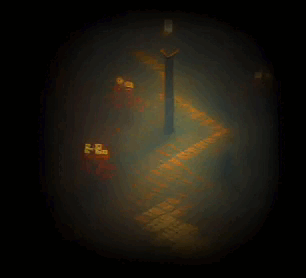

# Lost in an Infinite Forest

_You are lost in the forest.  It is getting dark.  Find your way home._

An experiment in AI games.

Every scene you encounter is unique to your play through.  It is created on demand and will never be seen again.  You can wander through this infinite forest forever.

## To install and run

With [poetry](https://python-poetry.org/):

- `poetry install`
- `poetry run python main.py`

You can also install with `pip`:

- `python3 -m venv .venv`
- `source .venv/bin/activate`
- `pip install -r requirements.txt`
- `python main.py`

Either way a window will open full screen with the game.

## To build

This uses [pyinstaller](https://pypi.org/project/pyinstaller/) to make an executable.

    pyinstaller --onefile main.py --add-data "images:images" --noconsole -n lost

This will build an executable for the operating system you are using in `dist/lost` (it takes a few seconds to boot up after opening.)
